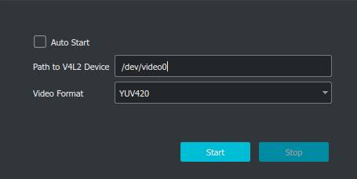

# obs-v4l2sink

This plugin provides output ability to v4l2 device . It is basically a Linux version of [obs-virtual-cam](https://github.com/CatxFish/obs-virtual-cam), but only contains the video sink part. You can use it with [v4l2loopback](https://github.com/umlaeute/v4l2loopback) to achieve cross-program image transfer between obs-studio and third party software supporting Video4Linux.  

# Usage with v4l2loopback

- Make sure to [load the v4l2loopback module][run-v4l2loopback] and check the Device Path.
  - If using Chrome or Chromium you must use the option `exclusive_caps=1`.
- Open OBS and select the menu entry `Tools > V4L2 Video Output`.
- Fill in the Device Path and select the appropriate video format.
- Click the `Start` button.



[run-v4l2loopback]: https://github.com/umlaeute/v4l2loopback#run

# Build
- Install QT
```
sudo apt install qtbase5-dev
```
- Get obs-studio source code
```
git clone --recursive https://github.com/obsproject/obs-studio.git
```
- Build plugins
```
git clone https://github.com/CatxFish/obs-v4l2sink.git
cd obs-v4l2sink
mkdir build && cd build
cmake -DLIBOBS_INCLUDE_DIR="../obs-studio/libobs" -DCMAKE_INSTALL_PREFIX=/usr ..
make -j4
sudo make install
``` 
